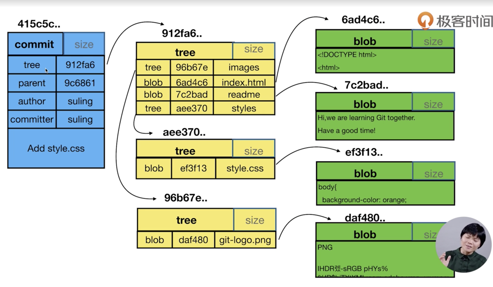

# Git 常用命令总结
> `git help --web log` 使用帮助查看命令使用方法  
> `git init [文件夹]`创建裸仓库
```
.git
    |--HEAD                                     # ref: refs/heads/main 分支引用，指向当前分支
    |--config                                   # 存放git config --global --list相关信信息
    |--object                                   # 存放git相关的对象信息
    |--refs                                     # 引用相关
      |--heads                                  # 存放分支
      |  |--master                              # 文件存放一个引用的id,git cat-file -t id查看当前引用文件类型COMMIT
      |--tags                                   # 存放标签
         |--tag名                               # 存放一个ID，对应heads存放的一个引用id 
      |--                                   # 存放标签
         |--tag名                               # 存放一个ID，对应heads存放的一个引用id 
```
## commit, tree, blob三种对象的关系
1. 一个commit对应一棵树，是当前项目所有问文件的一个快照；  
2. 树(tree)可以理解为文件夹目录树；  
3. 目录中的文件对应一个blob；  
4. blob和文件名无关，只要内容相同就认为是同一个文件； 
5. 文件被追踪（`git add`）后，首先会在object文件夹中创建一个文件，文件中存储着blob的引用；  
6. 在完成commit后，生成commit对象，tree对象，指向blob对象；

下面是一次提交对应的图示：    


## 理解HEAD指针
+ HEAD是一个引用（`ref`），是`.git`文件夹HEAD文件所指向的引用；
+ HEAD无论是指向分支，还是分离头指针（`detached HEAD state`），本质是指向一个commit对象；
+ 可以使用`HEAD`，`HEAD^`，`HEAD~2`，表示对应的commit引用；
> 特别说明：  
> 使用`git checkout hash值`会进入分离头指针转态（`detached HEAD state`），它不关联任何分支； 
> 在切换分支时可能造成commit丢失，可以使用`git branch <new-branch-name> hash值`创建保存分支；
## git config

> git 仓库配置信息

```bash
git config --global user.name 'xxxx'
git config --global user.emal 'xxxx'
# 查看config 配置
# --global 全局； --local 本地； --system 系统；
git config --global --list
```

## git 文件相关

```bash
git add 'xxx'                          # 交暂存区
git add -u                             # 将修改的文件提交暂存区
git rm 'xxx'                           # 移除文件
git mv 'xxx' 'aaa'                     # 文件重命名
git commit -m 'xxx'                    # 将暂存区文件提交到本地仓库
git commit -am 'xxx'                   # 将工作区文件提交到本地仓库
```

## git 日志相关
```bash
git log                                # 查看日志
git log --oneline                      # 查看日志，简单描述
git log -n3                            # 查看日志，3行
git log --grath                        # 查看日志，视图
git log --all                          # 查看日志，所有分支
git log 分支名                          # 查看指定分支的日志
```
## git 修改commit提交信息
```bash
git commit --amend                    # 进入vim编辑器修改commit信息
git rebase - i 父级commit引用          # 进入交互信信息
```

## git 分支相关
```bash
git checkout -b 分支名                 # 创建并切换分支；
git branch -d 分支名                   # 删除分支；
git branch -D 分支名                   # sure删除分支；
```

## git 差异化
```bash
git diff --cached                     # 比较暂存区和HEAD
git diff (-- 文件名)                  # 比较工作区和暂存区的差异
git diff (分支名 分支名 --文件名)      # 比较分支文件差异
```

## git 恢复操作
```bash
git checkout (-- 文件名)             # 用暂存区覆盖工作区
git reset HEAD (-- 文件名)           # 用HEAD覆盖暂存区
```

## git stash
将文件存放到stash，而不影响工作区
```bash
git stash                           # 将文件存储到堆栈同时恢复工作区
git stash --list                    # 查看堆栈信息
git stash pop                       # 将堆栈文件弹出恢复到工作区
git stash apply                     # 将堆栈文件弹出恢复到工作区, 不改变stash
```

## git仓库备份
> 哑协议：直接使用本地文件路径作为仓库的地址；
> 智能协议：直接使用file://协议文件路径作为仓库的地址；

```bash
git remote add 远程名 远程地址
```